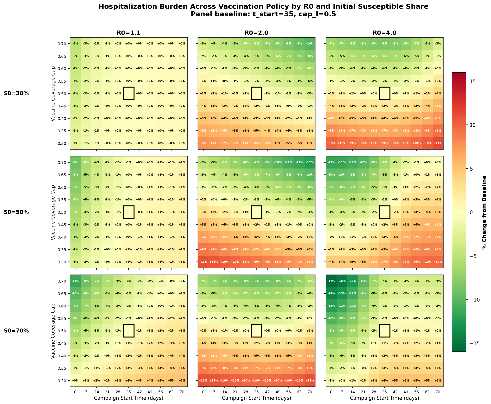
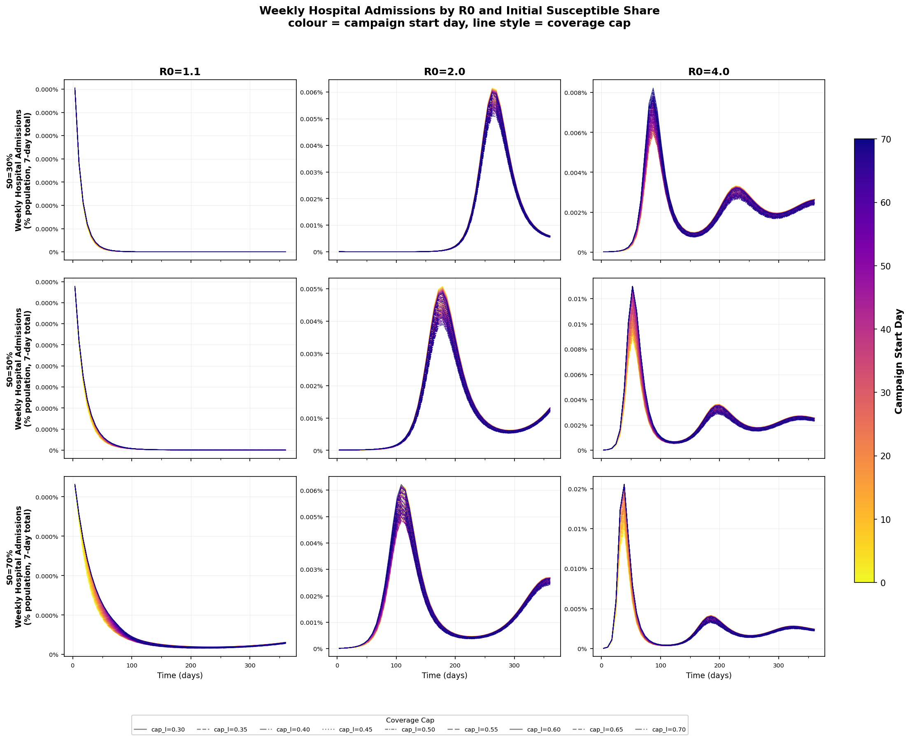
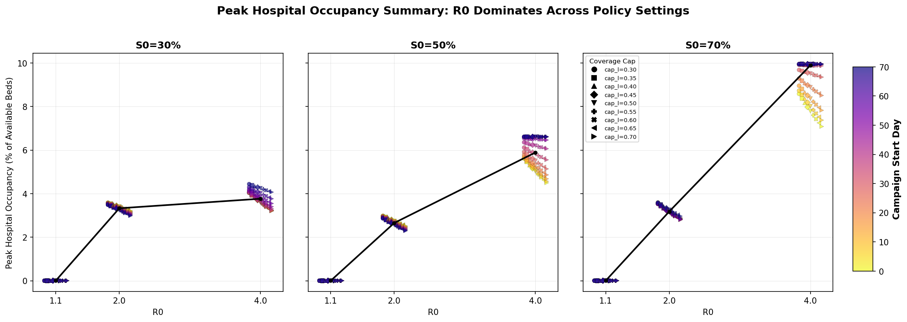

# Vaccination Campaign Scenario Grid Example

This guide walks through a policy-sweep SIRHD model with vaccination strata, and shows how to set up the configuration and figure-generation workflow in `flepimop2`.

This example uses [`op_system`](https://github.com/ACCIDDA/op_system) for transition-based model specification and [`op_engine`](https://github.com/ACCIDDA/op_engine) for numerical integration, using a vaccination axis with compartments `u` (unvaccinated), `v` (vaccinated/protected), and `w` (vaccinated but waned). This pairing keeps the disease dynamics readable in configuration while delegating solver behavior to the engine layer.

## 1. Start from a New Repository

Create a fresh repo and scaffold the project skeleton:

```bash
mkdir vaccination-campaign-scenario-grid
cd vaccination-campaign-scenario-grid
flepimop2 skeleton .
```
Then type `just`.  Followed by `conda activate ./venv`.  
You are now ready to use flepimop2. 

## 2. Get the Example Config and Plot Scripts

Copy the files below into your project. Each block can be expanded to view and copy the full source, or downloaded directly via the filename link.

Suggested placement in your new project:

- `configs/SIRHD_vax_scenario_grid.yml`
- `postprocessing/scenario_heatmap_3x3.py`
- `postprocessing/scenario_spaghetti_incidence.py`
- `postprocessing/scenario_peak_bed_summary.py`

[`SIRHD_vax_scenario_grid.yml`](../examples/vaccination-campaign-scenario-grid/config/SIRHD_vax_scenario_grid.yml)

??? example "Configuration - `configs/SIRHD_vax_scenario_grid.yml`"
    ```yaml
    --8<-- "examples/vaccination-campaign-scenario-grid/config/SIRHD_vax_scenario_grid.yml"
    ```

[`scenario_heatmap_3x3.py`](../examples/vaccination-campaign-scenario-grid/scripts/scenario_heatmap_3x3.py)

??? example "Plot Script - `postprocessing/scenario_heatmap_3x3.py`"
    ```text
    --8<-- "examples/vaccination-campaign-scenario-grid/scripts/scenario_heatmap_3x3.py"
    ```

[`scenario_spaghetti_incidence.py`](../examples/vaccination-campaign-scenario-grid/scripts/scenario_spaghetti_incidence.py)

??? example "Plot Script - `postprocessing/scenario_spaghetti_incidence.py`"
    ```text
    --8<-- "examples/vaccination-campaign-scenario-grid/scripts/scenario_spaghetti_incidence.py"
    ```

[`scenario_peak_bed_summary.py`](../examples/vaccination-campaign-scenario-grid/scripts/scenario_peak_bed_summary.py)

??? example "Plot Script - `postprocessing/scenario_peak_bed_summary.py`"
    ```text
    --8<-- "examples/vaccination-campaign-scenario-grid/scripts/scenario_peak_bed_summary.py"
    ```

## 3. Model Structure in `system`

At a high level, this model uses `op_system` transitions to define disease flows and `op_engine` to advance those transitions over time, with state vectors per vaccination stratum for `S`, `I`, `H`, `R`, plus global `D`.

```yaml
system:
  - module: op_system
    state_change: flow
    spec:
      kind: transitions

      axes:
        - name: vax
          coords: [u, v, w]

      state:
        - S[vax]
        - I[vax]
        - H[vax]
        - R[vax]
        - D
```

For additional context on module wiring (`module`, `state_change`, and transition specs), see [Implementing Custom Engines and Systems](../development/implementing-custom-engines-and-systems.md).

## 4. Aliases: Derived Terms and Rates

Aliases define reusable expressions and are often where model intent is most explicit. Expression syntax here is evaluated by `op_system`; for allowed expression forms and semantics, see the [op_system repository](https://github.com/ACCIDDA/op_system). For broader module-wiring context, see [Implementing Custom Engines and Systems](../development/implementing-custom-engines-and-systems.md).

```yaml
aliases:
  N: "sum_over(vax=j, S[vax=j] + I[vax=j] + H[vax=j] + R[vax=j])"
  lam: "(r0 / t_inf) * sum_over(vax=j, I[vax=j]) / N"
  rho_eff[vax]: "q[vax] * rho"
  delta_eff[vax]: "q[vax] * delta"
  pop[vax]: "S[vax] + I[vax] + H[vax] + R[vax]"
  coverage: "sum_over(vax=j IN [v, w], pop[vax=j]) / n0"
  rollout: "1.0 - np.exp(-ramp * np.maximum(0.0, t - t_start))"
  u: "np.maximum(0.0, k * (cap_l - coverage)) * rollout"
```

How to read this:
- `lam` is force of infection scaled by current infectious prevalence.
- `rho_eff[vax]` and `delta_eff[vax]` apply severity multipliers by vaccination stratum.
- `coverage` measures cumulative ever-vaccinated share (`v + w`).
- `u` is a dynamic campaign rate with two constraints:
  - starts after `t_start` (via `rollout`),
  - saturates as coverage approaches `cap_l`.

## 5. Transitions and Coordinate Shifts

The transition graph includes infection, progression, recovery, death, waning immunity, and vaccination movement between axis coordinates.

```yaml
transitions:
  - from: S[vax]
    to: I[vax]
    rate: lam

  - from: I[vax]
    to: H[vax]
    rate: rho_eff[vax] / t_inf
  - from: I[vax]
    to: R[vax]
    rate: (1 - rho_eff[vax]) / t_inf

  - from: H[vax]
    to: D
    rate: delta_eff[vax] / t_hosp
  - from: H[vax]
    to: R[vax]
    rate: (1 - delta_eff[vax]) / t_hosp

  - from: R[vax]
    to: S[vax]
    rate: alpha

  - coord_shift:
      vax: "u -> v"
    apply_to: [S, R]
    rate: u

  - coord_shift:
      vax: "v -> w"
    apply_to: [S, R]
    rate: omega
```

`coord_shift` is the key mechanism for axis-based state movement. Here:
- vaccination moves people from `u` to `v` in `S` and `R`,
- vaccine protection wanes from `v` to `w` in `S` and `R`.

## 6. Engine and Numerical Integration

```yaml
engine:
  - module: op_engine
    state_change: flow
    config:
      method: heun
      adaptive: true
      rtol: 1.0e-3
      atol: 1.0e-5
      dt_min: 1.0e-10
      dt_max: 2.0
      safety: 0.9
```

This uses adaptive Heun integration with bounded step sizes.

## 7. Scenario Axes and Policy Sweep

This config separates policy sweep axes from panel axes:

```yaml
scenarios:
  vax_campaign:
    module: grid
    parameters:
      t_start: [0, 7, 14, 21, 28, 35, 42, 49, 56, 63, 70]
      cap_l: [0.30, 0.35, 0.40, 0.45, 0.50, 0.55, 0.60, 0.65, 0.70]

  panel_grid:
    module: grid
    parameters:
      r0: [1.1, 2.0, 4.0]
      s_frac: [0.3, 0.5, 0.7]
```

Conceptually:
- `vax_campaign` spans policy levers (start timing and max coverage).
- `panel_grid` controls epidemiologic context (transmissibility and initial susceptible share).

## 8. Simulate, Backend, and Process Blocks

Simulation and output routing:

```yaml
simulate:
  scenario_sweep:
    times: "0.0:1.0:364.0"
    scenario: vax_campaign

backend:
  - module: csv
    root: model_output/SIRHD_vax
```

The three retained figure-generation targets:

```yaml
process:
  scenario_heatmap_3x3_run_batch_and_plot:
    module: shell
    command: python postprocessing/scenario_heatmap_3x3.py
    args:
      - configs/SIRHD_vax_scenario_grid.yml
      - model_output/plots/SIRHD_vax/SIRHD_vax_scenario_heatmap_3x3.png
      - --run
      - --burden-only

  scenario_spaghetti_incidence:
    module: shell
    command: python postprocessing/scenario_spaghetti_incidence.py
    args:
      - configs/SIRHD_vax_scenario_grid.yml
      - model_output/plots/SIRHD_vax/SIRHD_vax_spaghetti_incidence.png

  scenario_peak_bed_summary:
    module: shell
    command: python postprocessing/scenario_peak_bed_summary.py
    args:
      - configs/SIRHD_vax_scenario_grid.yml
      - model_output/plots/SIRHD_vax/SIRHD_vax_peak_bed_summary.png
```

## 9. Running the Example

Before running these commands add `SIHRD_vax` and `plots` subdirectories to the `model_output` folder created by the `flepimop2 skeleton` command.

From a working environment with `flepimop2` available.

First run:

```bash
flepimop2 simulate configs/SIRHD_vax_scenario_grid.yml --target scenario_sweep
```
This generates all of the simulations that will act as the source for the rest of our analysis.  Then run:

```bash
flepimop2 process configs/SIRHD_vax_scenario_grid.yml --target scenario_heatmap_3x3_run_batch_and_plot
```
This gives you a 3x3 heatmap for baseline vaccination scenarios.  Next we can examine weekly time-varying incidence "spaghetti" plots:

```bash
flepimop2 process configs/SIRHD_vax_scenario_grid.yml --target scenario_spaghetti_incidence
```

Finally, we can examine the amount of beds expected to be occupied during peak hospitalizaion prevelance assuming ~3 beds per 1000 individuals in the population:

```bash
flepimop2 process configs/SIRHD_vax_scenario_grid.yml --target scenario_peak_bed_summary
```

## 10. Figure Interpretation

### 3x3 Policy Heatmap (Burden)



The burden surface changes meaningfully across epidemiologic context. In the lower-transmission column (`R0=1.1`), most cells stay near zero change, indicating limited room for campaign timing/cap policy to improve outcomes once transmission is already constrained. In the moderate/high-transmission columns (`R0=2.0` and `R0=4.0`), the gradient is strong: earlier starts and higher caps (upper-left of each panel) are consistently greener (lower burden), while delayed starts and lower caps trend orange/red (higher burden), with the largest penalties in higher-susceptibility settings. The black baseline box (`t_start=35`, `cap_l=0.5`) is a useful anchor: policy improvements are most pronounced where epidemic pressure is highest, and comparatively muted where pressure is low.

### 3x3 Weekly Incidence Trajectories



These trajectories show not just peak size but peak timing and rebound structure. At `R0=1.1`, admissions rapidly decay toward near-zero regardless of policy, matching the weak burden sensitivity in the heatmap. At `R0=2.0`, policies mainly reshape a dominant first-wave peak and a later tail/rebound: earlier starts and larger caps visibly compress and lower the main hump. At `R0=4.0`, a sharp early peak appears across all rows, but policy still separates trajectories afterward, especially in the post-peak shoulder and secondary wave where high-cap/early-start strategies suppress sustained admission pressure. The color ordering (campaign start day) is particularly informative: later starts cluster toward higher curves around wave maxima.

### Peak Occupancy Summary (R0 Dominance)



This summary makes the dominant driver explicit: moving from `R0=1.1` to `R0=4.0` shifts peak occupancy far more than any within-column policy tweak. The black median line rises steeply with `R0` in each `S0` facet, while colored/shape-coded policy points spread around that line with smaller horizontal-group variance. Policy still matters in the high-pressure regime (the `R0=4.0` clusters show visible vertical spread by start day and cap), but the scale of that spread is secondary to transmission intensity itself. Operationally, this suggests campaign optimization is valuable, yet controlling effective transmission has first-order impact on peak bed risk.

## 11. Complete Config Example

[`SIRHD_vax_scenario_grid.yml`](../examples/vaccination-campaign-scenario-grid/config/SIRHD_vax_scenario_grid.yml)

??? example "Complete Configuration - `configs/SIRHD_vax_scenario_grid.yml`"
    ```yaml
    --8<-- "examples/vaccination-campaign-scenario-grid/config/SIRHD_vax_scenario_grid.yml"
    ```
